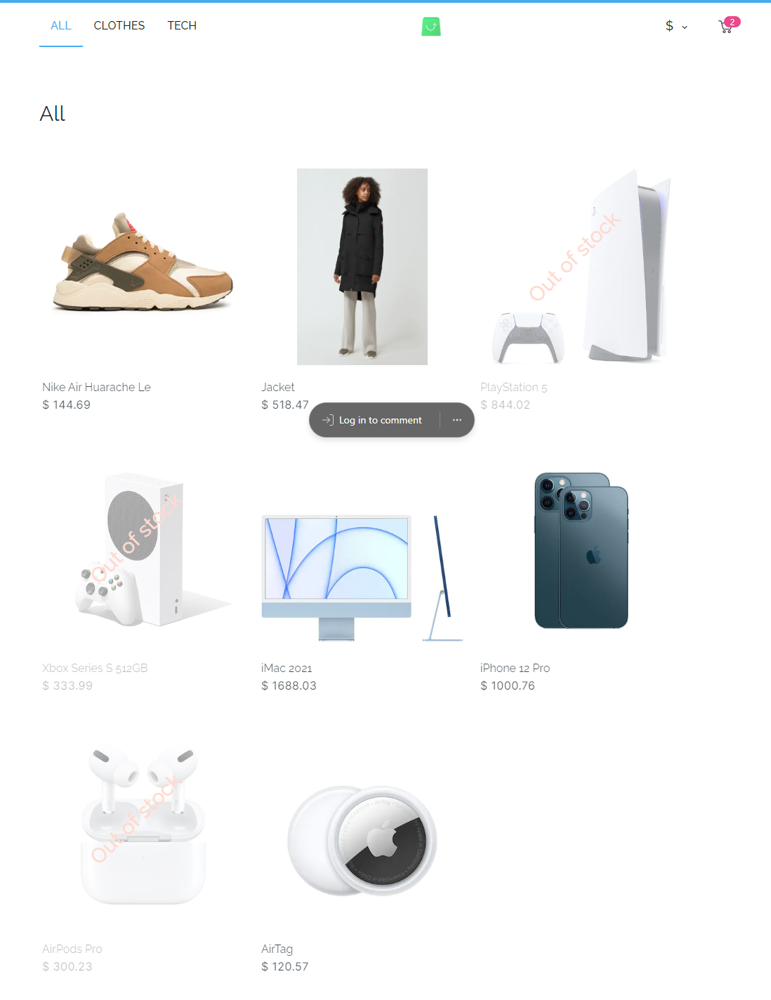

# SCANDI-SHOP

> This is an prototype e-commerce app with components / pages such as the homepage, category page, description page, cart page built with Next.js.
 > This app is inspired by a frontend test assessment from scandiweb, and as such, the data used and design is that of the test assessment by scandiweb.



## Built With

- NextJS
  - NextJS shallow routing
  - NextJS Image component

- React
  - JSX
  - React Context API
  - React Responsive Carousel Library

  - Hooks
    - useState
    - useEffect
    - useContext

- Tailwind CSS
  - DaisyUi plugin

[Live demo link](https://scandi-shop-nextjs.vercel.app/)

### Development (Running locally)

- Clone the project

```bash
git clone https://github.com/Lanr3waju/scandi-shop-nextjs.git

```

- Install Dependencies

```bash
yarn install
```

To automatically fix eslint issues found (where possible):

```bash
yarn run lint
```

## 👤 Author

- Github: [@Lanr3waju](https://github.com/Lanr3waju>)
- LinkedIn: [@Abass Olanrewaju](https://www.linkedin.com/in/lanr3waju/)

## 🤝 Contributing

Contributions, issues and feature requests are welcome!

Feel free to check the [issues page](../../issues).

## Show your support

Give a ⭐️ if you like this project!

## Acknowledgments and Resources used

- [Icons8](https://icons8.com/)
- [daisyUI](https://daisyui.com/)
- [Scandiweb](https://scandiweb.com/)
- [Leandrowd React Responsive Carousel](https://github.com/leandrowd/react-responsive-carousel.git)
- [Anxiny Image Magnifier](https://dev.to/anxiny/create-an-image-magnifier-with-react-3fd7)

## 📝 License

[MIT licensed](./LICENSE).
